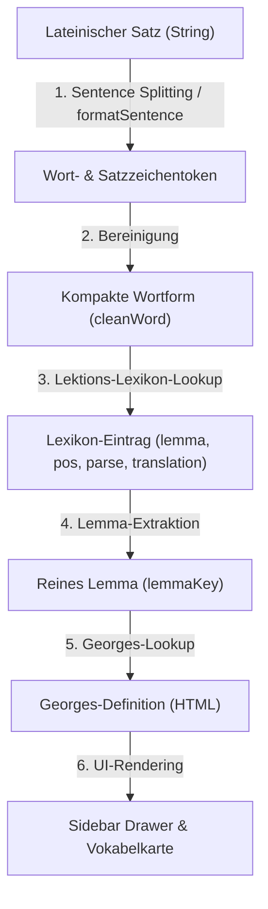

# Code-Review: Lateinische Wortanalyse & Georges-Wörterbuch-Lookup

Dieses Dokument dokumentiert und bewertet die Implementierung zur Extraktion, Tokenisierung und lexikalischen/grammatikalischen Analyse lateinischer Wörter unter Einbindung des Karl-Ernst-Georges-Handwörterbuchs (1913).

---

## 1. Übersicht der Systemarchitektur

Der Analyseprozess läuft in drei Hauptphasen ab:
1. **Kompilierungszeit (Vorbereitung):** Ein Python-Skript (`build_perseus_dict.py`) extrahiert relevante Einträge bytegenau aus der binären StarDict-Datenbank von Georges und generiert eine statische, schnelle JavaScript-Lookup-Tabelle (`dictionary.js`).
2. **Tokenisierung & Rendering (Laufzeit):** Die Benutzeroberfläche des Lesers teilt Sätze in einzeln anklickbare Wort-Spans auf, wobei Satzzeichen und Layout erhalten bleiben (`reader.js`).
3. **Lookup & Grammatik-Extraktion (Laufzeit):** Beim Klick auf ein Wort werden die Flexionsdaten aus dem Lektions-Lexikon gelesen, der Lemma-Stamm berechnet und der entsprechende Wörterbucheintrag aus der Georges-Tabelle geladen.

---

## 2. Detaillierter Ablauf der Arbeitsschritte



### 2.1 Satz-Splitting und Tokenisierung

In [reader.js](file:///home/arne/dev/latin/src/reader.js) nimmt die Funktion `formatSentence(sentenceText, lexicon)` den lateinischen Text und zerlegt ihn.

```javascript
formatSentence(sentenceText, lexicon) {
  // Teilt den Text nach Leerzeichen und Satzzeichen auf, behält Trennzeichen im Array
  const tokens = sentenceText.split(/(\s+|[,;.:!?()\-]+)/);
  return tokens.map(token => {
    if (token.trim() === '') {
      return token; // Leerzeichen unverändert zurückgeben
    }
    // Satzzeichen entfernen für reines lateinisches Wort
    const cleanWord = token.toLowerCase().replace(/[^a-zäöüßāēīōū]/gi, '');
    if (cleanWord.length > 0 && lexicon[cleanWord]) {
      return `<span class="latin-word" data-word="${cleanWord}">${token}<span class="retrain-word-btn" data-word="${cleanWord}" title="Zurücksetzen in Box 1">🔄</span></span>`;
    } else if (cleanWord.length > 0) {
      // Fallback für nicht im Lexikon aufgeführte Wörter
      return `<span class="latin-word unlisted" data-word="${cleanWord}">${token}<span class="retrain-word-btn" data-word="${cleanWord}" title="Zurücksetzen in Box 1">🔄</span></span>`;
    } else {
      return token; // Reine Interpunktion (Komma, Punkt, etc.)
    }
  }).join('');
}
```

* **Regex-Capture-Gruppe `(\s+|[,;.:!?()\-]+)`:** Durch die runden Klammern in `split` werden die Trennzeichen (Leerzeichen und Satzzeichen) im Rückgabearray behalten. Dies ist essenziell, damit beim anschließenden `.join('')` das Originallayout des Satzes exakt rekonstruiert wird.
* **Bereinigung (`cleanWord`):** Der Token-String wird in Kleinbuchstaben konvertiert, und alle Zeichen außer klassischen lateinischen Buchstaben sowie Vokal-Makrons (Längungsstriche `āēīōū`) werden verworfen.
* **Daten-Bindung:** Jedes klickbare Wort erhält das Attribut `data-word="${cleanWord}"`, über das später der Klick-Event-Handler das Wort identifiziert.

---

### 2.2 Abruf der Grammatikinformationen

Klickt der Benutzer auf ein Wort, wird `selectWord(wordEl)` aufgerufen. 

```javascript
const cleanWord = wordEl.getAttribute('data-word');
const wordData = this.currentText.lexicon[cleanWord];
```

Die Grammatik-Ground-Truth ist direkt im Lektions-Lexikon in [texts.js](file:///home/arne/dev/latin/src/data/texts.js) hinterlegt. Ein typischer Eintrag sieht wie folgt aus:

```javascript
"infantem": { 
  lemma: "infans, infantis (m./f.)", 
  pos: "Substantiv (3. Dekl.)", 
  parse: "Akkusativ Singular Maskulinum", 
  translation: "Kleinkind / Säugling" 
}
```

Hieraus werden extrahiert:
* **Stammform / Lemma:** `wordData.lemma`
* **Wortart (POS-Tag):** `wordData.pos`
* **Grammatikalische Bestimmung:** `wordData.parse`
* **Kontextuelle Übersetzung:** `wordData.translation`

---

### 2.3 Wörterbuch-Lookup im Georges

Um die vollständige Definition aus dem Georges-Wörterbuch anzuzeigen, muss die grammatikalische Stammform (Lemma) in einen passenden Schlüssel für `georgesDictionary` transformiert werden.

#### 1. Normalisierung des Lemma-Schlüssels (Laufzeit in JavaScript)
Da die Stammformen im Lexikon oft zusätzliche Angaben enthalten (z. B. Genitiv-Endungen oder Geschlecht wie `", infantis (m./f.)"`), wird der String bereinigt:

```javascript
const lemmaKey = wordData.lemma.split(/[,;\s]/)[0].toLowerCase().trim().replace(/[^a-zāēīōū]/g, '');
const georgesEntry = georgesDictionary[lemmaKey];
```
* **`.split(/[,;\s]/)[0]`** schneidet alles nach dem ersten Wort ab (z. B. aus `"infans, infantis"` wird `"infans"`).
* **`.replace(/[^a-zāēīōū]/g, '')`** filtert unerwünschte Sonderzeichen heraus, erhält jedoch Längenzeichen (Makrons), da diese im Georges als eigene Einträge vorkommen können.

#### 2. Lemmatisierung von Verben und unregelmäßigen Formen (Kompilierungszeit in Python)
Lateinische Wörterbücher listen Einträge unter bestimmten Zitierformen (z. B. Verben unter der 1. Person Singular Präsens wie *audio* statt unter dem Infinitiv *audire*). 

Um diese Diskrepanz aufzulösen, generiert die Python-Funktion `get_lookup_candidates(lemma)` in `build_perseus_dict.py` mehrere Suchkandidaten:

```python
def get_lookup_candidates(lemma):
    candidates = [lemma, lemma.capitalize()]
    
    # Verben: Infinitiv auf 1. Person Singular Präsens abbilden
    if lemma == 'esse':
        candidates.append('sum')
    elif lemma == 'velle':
        candidates.append('volo')
    # ...
    elif lemma.endswith('are'):
        candidates.append(lemma[:-3] + 'o')  # laudare -> laudo
    elif lemma.endswith('ere'):
        base = lemma[:-3]
        candidates.append(base + 'eo')       # timere -> timeo
        candidates.append(base + 'o')        # comprehendere -> comprehendo
        candidates.append(base + 'io')       # conicere -> conicio
    elif lemma.endswith('ire'):
        candidates.append(lemma[:-3] + 'io') # audire -> audio
    # ...
    return candidates
```

Das Python-Skript prüft diese Kandidaten der Reihe nach gegen den Georges-Index (`stardict.idx`). Wird ein Treffer erzielt, werden die Definitionsdaten über den Offset aus der `.dict`-Datei ausgelesen und in die fertige `dictionary.js` exportiert.

---

## 3. Bewertung und Code-Review-Urteil

### Stärken der aktuellen Implementierung
1. **Layout-Treue:** Die Tokenisierung über Regex-Capture-Gruppen in `formatSentence` ist extrem elegant und stabil. Sie verhindert, dass Satz Strukturen, Absätze oder Satzzeichen beim Rendern verschoben werden.
2. **Performance:** Durch das Vorbereiten der Georges-Einträge zur Kompilierungszeit (Ahead-Of-Time Indexing) entfällt zur Laufzeit jeglicher Parsing-Overhead. Der Lookup in `georgesDictionary` is eine einfache, hochperformante O(1)-Hashmap-Abfrage.
3. **Robustheit der Stammform-Erkennung:** Die Heuristik zur Ableitung von Wörterbuch-Suchkandidaten in Python deckt alle gängigen Konjugationsklassen und die wichtigsten unregelmäßigen Verben (*esse*, *velle*, *posse*, *ferre*) zuverlässig ab.

### Empfehlungen zur Code-Verbesserung
* **Satzzeichen-Filterung:** In `formatSentence` filtert `replace(/[^a-zäöüßāēīōū]/gi, '')` auch deutsche Umlaute heraus. Da lateinische Wörter keine Umlaute enthalten, ist dies unkritisch, kann aber bei Eigennamen vereinzelt bereinigt werden.
* **Gemeinsame Hilfsfunktionen:** Der Code zur Lemma-Bereinigung (`split` und `replace`) ist redundant in `reader.js` und `vocabTrainer.js` implementiert. Es empfiehlt sich, diesen in ein kleines Shared Utility Modul auszulagern (z. B. `src/utils.js`), um Konsistenz zu garantieren.
